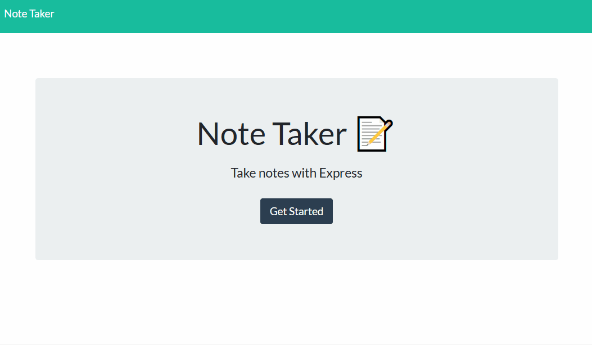

# Note Taking App

## About the Project
The Note Taking App allows the user to create notes, delete notes, and view past notes in one interface. Note data is maintained in a JSON database.

### Features
* Simple UI
* Title and text fields for notes
* Unique ids for notes
* View and delete previous notes

### Built With
* [Express](https://www.npmjs.com/package/express)
* [fs-extra](https://www.npmjs.com/package/fs-extra)
* [nanoid](https://www.npmjs.com/package/nanoid)

## Geting Started
1. Visit [this page]() to view the app on Heroku.
2. Click on the `Get Started` button to go to the notes page.
3. To create a new note, enter a note title and some text, then click the save button in the top right corner.
4. The saved note will appear in the list on the left.
5. To delete a note, click on the trash icon next to the note's title.
6. To create a new note, click on the plus icon in the top right corner.
7. To view created notes, click on the note titles in the list on the left.

### Prerequisite
Have an internet connection and access to a modern browser.

## License
Distributed unter the MIT license. See `LICENSE.txt` for more information

## Contact
Alexis Woelffer - [awoelf@outlook.com](mailto:awoelf@outlook.com)

[![LinkedIn][linkedin-shield]][linkedin-url]

<!-- Links and images -->
[linkedin-shield]: https://img.shields.io/badge/-LinkedIn-black.svg?style=for-the-badge&logo=linkedin&colorB=555
[linkedin-url]: https://linkedin.com/in/alexis-w-dev

(<a href="#readme-top">back to top</a>)
